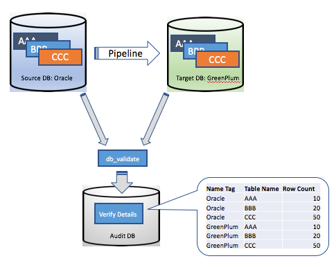
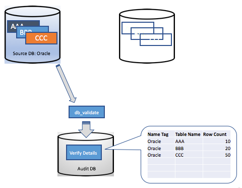
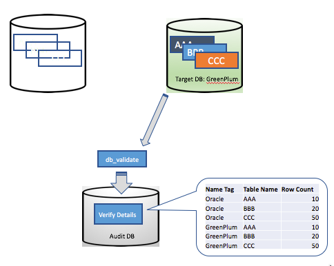
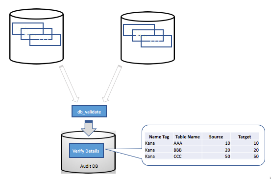

# Data Pipeline Data Validator


# Introduction
The *Data Pipeline Data Validator* provides a framework for independantly validating data transfer


## Goals for db-validator

- Keep it simple (eg., Query tables in isolation)
- Keep the data in place; use SQL to generate rowcounts, hash etc., in-place and just return the result across the wire
- Reuse framework of data-pipeline; consider as an add-on
- Processing is “on-demand”




## Processing Overview

- Only a single database is evaluated at a time
- The role (source or target) is not relevant
- Tag’s are used to describe environments and a collection of tables (eg., “Kana Oracle Production”).  
- A collection of tables against the tag is described with a regular expression (eg., KE_AGENTDESKTOP.[A-Z].*)




## Processing Steps

- Results are only computed for named tag
- Existing computations from other tags remain (ie., they build up for later comparison)
- Default computation is rowcount for all rows
- Alternate computations can be specified (eg., sum {pk})
- Predicates can be added (eg., where create_date < trunc(sysdate) )




## Running db_validator.py 

```text
python db_validator.py \
    --audituser user/password@host:port/db \
    --validateuser user/password@host:port/db \
    --validatedbtype postgres \
    --validatetag "Kana GP Target"
```


## Results

- A view joins multiple result sets for simple comparison




